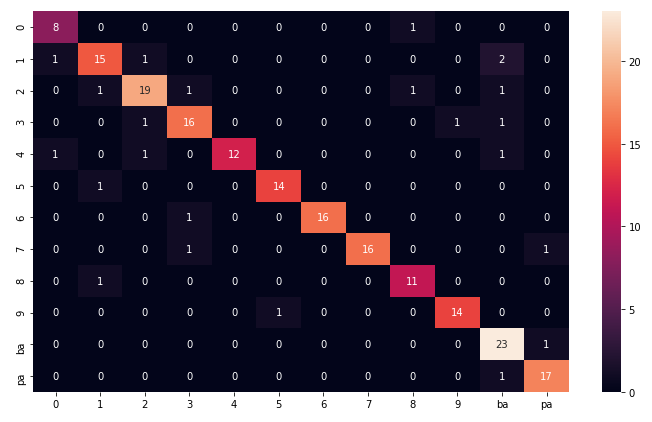
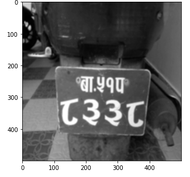
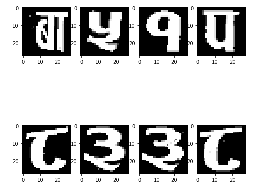
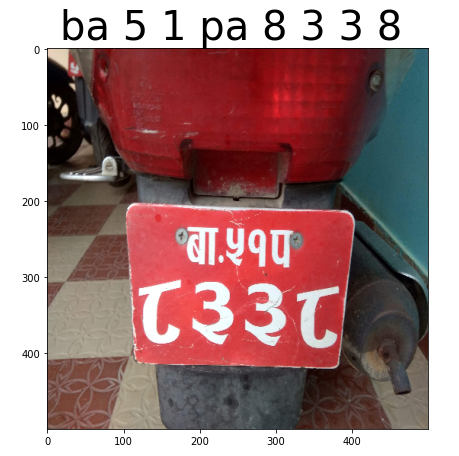

# NumberPlateCNN
## In this project a CNN is trained to recognize number plate from an image. At first a model is trained to recognize number plate digit and numbers. Then the charector segmentation is performed and the charectors are recognized.

## Step performed:
1) Trained a  CNN model in using Pytorch.
 </br>
 90% training accuracy and 88% test accuracy was obtained after 8 epochs.
<div align = 'center'>
		
	<h5>Confusion Matrix after test.</h5>
</div>
</br>
2) Loaded the Image and performed charector segmentation.
<div align = 'center'>
	
	<h5>Gray scaled image.</h5>
	</br>
	
	<h5>After segmentation</h5>
	</br>
</div>
3) Recognize the charectors after segmantation.
	<div align = 'center'>
		
		<h5>Final prediction result. </h5>
	</div>

## Dataset:
  The dataset is available in [this repository](https://github.com/Prasanna1991/LPR).
```
Citation:
@inproceedings{pant2015automatic,
  title={Automatic Nepali Number Plate Recognition with Support Vector Machines},
  author={Pant, Ashok Kumar and Gyawali, Prashnna Kumar and Acharya, Shailesh},
  booktitle={Proceedings of the 9th International Conference on Software, Knowledge, Information Management and Applications (SKIMA)},
  pages={92--99},
  year={2015}
}
```